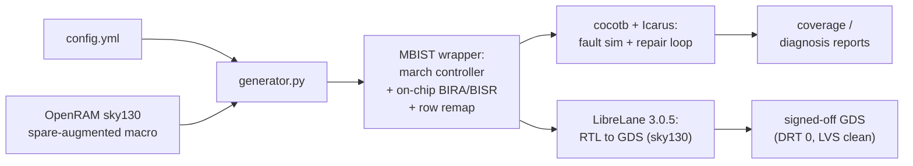

# autoMBIST

[](https://github.com/ranaumarnadeem/autoMBIST/actions/workflows/test.yml)
[](https://ranaumarnadeem.github.io/autoMBIST/)
[](LICENSE)

**[📖 Full documentation](https://ranaumarnadeem.github.io/autoMBIST/)** — quickstart,
installation, worked examples, architecture, the CLI reference, the LibreLane
hardening recipe, and the roadmap. This README is a fast overview; the docs
site has the detail.

**An open-source, OpenRAM-integrated MBIST + BIRA + BISR generator and
march-algorithm research platform — proven through open RTL-to-GDS closure on
sky130.**

autoMBIST tests memory macros for manufacturing defects, repairs them with
built-in row/column redundancy, and lets you research the march algorithms
that do it — all behind one CLI. It's really two independent subsystems:

1. **MBIST wrapper generation + array fault simulation** (`generate`,
   `simulate`, `run`) — takes an OpenRAM-style SRAM macro and a config file
   describing its pins, and emits synthesizable MBIST wrapper + march-controller
   RTL around it, with stuck-at/transition/inter-port-coupling fault injection
   through cocotb + Icarus Verilog.
2. **Functional fault-primitive research platform** (`test`, `algo`) — an
   independent, Verilator-driven toolchain built around a 31-primitive
   functional fault-model DSL and a programmable march-algorithm engine, for
   grading a march algorithm (or a real controller FSM) with no memory macro
   required.

They don't share RTL, a simulator, or a fault format — see
[Which subsystem do I want?](#which-subsystem-do-i-want).

## Table of Contents

- [Which subsystem do I want?](#which-subsystem-do-i-want)
- [Redundancy repair (BIRA/BISR) and physical closure](#redundancy-repair-birabisr-and-physical-closure)
- [Quick Start](#quick-start)
- [Fault coverage](#fault-coverage)
- [Command overview](#command-overview)
- [Installation](#installation)
- [Further Documentation](#further-documentation)

## Which subsystem do I want?

**I have a real memory macro and want to MBIST-test it (or grade the
controller against manufacturing faults):** use the classic path —
`autombist generate` → `autombist simulate` (or `autombist run` for both).
Start at [Quick Start](#quick-start).

**I want to design/validate a march algorithm, measure its functional fault
coverage, or check a controller FSM against a fault library — no real memory
macro required:** use the research path — `autombist test` for one-shot
grading, or `autombist algo` for the interactive shell. See the
[Algo-Shell Guide](https://ranaumarnadeem.github.io/autoMBIST/algo-shell-guide.html).

## Redundancy repair (BIRA/BISR) and physical closure

Beyond generating a test wrapper, autoMBIST closes the loop: it wraps a
spare-augmented OpenRAM macro with **redundancy analysis (BIRA)** and
**self-repair (BISR)**, and hardens the result to GDS through the open
[LibreLane](https://github.com/librelane/librelane) flow — a **2D BIRA
solver** (must-repair fixed point + backtracking), external row/column-repair
remaps that need no special macro views, and an **autonomous on-chip
self-repair FSM** (analyze → decide → verify, no tester) covering five of
the project's six march algorithms.



**Proven RTL-to-GDS closure:** a realistic 3-memory sky130 subsystem
([`flow/multimem/mbist/`](flow/multimem/mbist/)), self-repair wrapped around
every memory, hardens clean in LibreLane 3.0.5 — **0.91 mm² die, 7,189 std
cells, 0 detailed-routing violations, LVS-clean including power**. The same
result holds for march-X and MATS+ wrapping real OpenRAM macros
([`flow/newalgo/`](flow/newalgo/)), and for a real RV32I core (PicoRV32)
booting and running firmware through self-repaired memory
([`flow/soc/`](flow/soc/)).

That "LVS-clean" result is the top-level LibreLane place-and-route closure,
which treats each OpenRAM macro as opaque hard IP — a separate question from
whether the macros' own GDS is DRC/LVS-clean against their own generated
schematics. That per-macro signoff is currently unresolved (a stale vendored
OpenRAM checkout, not a defect in this project's RTL); see
[`flow/multimem/mbist/README.md`](flow/multimem/mbist/README.md#honest-signoff-caveats)
for the root cause.

Full writeup, the BIRA/BISR internals, and the reproducible hardening flow:
[Architecture](https://ranaumarnadeem.github.io/autoMBIST/architecture.html) and the
[demo walkthrough](https://ranaumarnadeem.github.io/autoMBIST/demo.html).

## Quick Start

```bash
# 1. Inside WSL/Linux, from the repo root:
nix develop

# 2. Scaffold a starter config in the current directory
autombist init --out .

# 3. Generate the MBIST wrapper + RTL for the memory described in config.yml
autombist generate --config config.yml --out out

# 4. Simulate the generated design with cocotb + Icarus
autombist simulate --out out/<memory_name>

# ...or do steps 3+4 in one shot:
autombist run --config config.yml --out out
```

`<memory_name>` is the `memory_name` field from your config file. Sanity-check
your whole install with `autombist smoke`; check which optional EDA tools
autombist can find on this system with `autombist doctor`. Full walkthrough:
[Quickstart](https://ranaumarnadeem.github.io/autoMBIST/quickstart.html) and
[Example](https://ranaumarnadeem.github.io/autoMBIST/example.html) in the docs.

## Fault coverage

The research path (`test`/`algo`) grades a march algorithm against a
31-primitive functional fault model. Measured detection (**D**) vs escape
(**E**) against `src/autombist/engine/faults.example.txt`, for the 29
primitives in that fault list:

| Fault | MATS+ (5n) | March Y (8n) | March C- (10n) | March C+ (14n) | March B (17n) | March SS (22n) |
|---|---|---|---|---|---|---|
| SA0, SA1 | D | D | D | D | D | D |
| TF0, TF1 | D | D | D | D | D | D |
| WDF0, WDF1 | E | E | E | E | E | D |
| RDF0, RDF1 | D | D | D | D | D | D |
| DRDF0, DRDF1 | E | D | E | D | E | D |
| IRF0, IRF1 | D | D | D | D | D | D |
| SOF | E | D | E | D | D | E |
| AF_NOACC, AF_ALIAS | D | D | D | D | D | D |
| CFIN | D | D | D | D | D | D |
| CFID | E | E | D | D | D | D |
| CFST | D | D | D | D | D | D |
| CFDS (any-read) | E | D | D | D | D | D |
| CFTR0, CFTR1 | D/E | D/E | D | D | D | D |
| CFWD0, CFWD1 | E | E | E | E | E | D |
| CFRD0, CFRD1 | E | E | D | D | D/E | D |
| CFIR0, CFIR1 | E | E | D | D | D/E | D |
| CFDRD0, CFDRD1 | E | E | E | D | E | D |
| **total** | **13/29** | **17/29** | **20/29** | **25/29** | **19/29** | **28/29** |

Seven built-in march algorithms ship with the research engine. Full
per-primitive semantics, escape rationale, and the seventh algorithm
(March X): [`src/autombist/engine/README.md`](src/autombist/engine/README.md).

## Command overview

| Command | What it does |
|---|---|
| `init` | Scaffold a starter `config.yml` + `openram.yml` + `Makefile` |
| `generate` | Emit MBIST wrapper RTL (+ fault injection with `--test`) |
| `simulate` | Run cocotb + Icarus against a `generate`d output directory |
| `run` | `generate` + `simulate` (+ optional `--faultflow`) in one shot |
| `test` | Grade a march algorithm or controller FSM against the functional fault DSL |
| `algo` | Interactive research shell — register algorithms/faults, run campaigns, export reports |
| `grade-controller` | FaultFlow scan-ATPG structural grading of the controller logic |
| `ram-synth` | Synthesize an SRAM macro through OpenRAM from a config |
| `harden` | Drive LibreLane RTL-to-GDS hardening |
| `fix-lef-units` / `macro-signoff` | LibreLane pre-flight and per-macro DRC/LVS signoff helpers |
| `shell` | Tcl-native alternative console (EDA-style `-flag value` syntax) |
| `doctor` / `smoke` | Report which EDA tools are on `PATH` / run an install sanity check |

Multi-port memories (`march-1r1w`, `march-2rw`) use a named `ports:` map
instead of the flat single-port form — full config shapes, port-coupling
faults, and cross-port fault-campaign syntax:
[Multi-Port Memory Guide](https://ranaumarnadeem.github.io/autoMBIST/multi-port-guide.html).
Every command's full flags: [CLI Reference](https://ranaumarnadeem.github.io/autoMBIST/cli-reference.html).

## Installation

> **Platform.** `autombist generate` and config/algorithm-spec tooling run
> anywhere Python 3.10+ runs. Everything that invokes a simulator or synthesis
> tool (`simulate`, `run`, `test`, `algo`'s `run`/`compare_algo`,
> `grade-controller --run`) needs the Unix EDA toolchain and only works on
> Linux or WSL.

Recommended — [Nix](flake.nix) pins the exact toolchain CI uses and puts the
`autombist` CLI on `PATH` immediately, no separate `pip install` step:

```bash
nix develop
```

Without Nix, from the repository root:

```bash
sudo apt-get install iverilog verilator yosys
python -m pip install -e .
```

Full details, including the physical/signoff toolchain:
[Installation](https://ranaumarnadeem.github.io/autoMBIST/installation.html).

## Further Documentation

This README covers install and orientation. For everything else, see the
published docs site:

- [Architecture](https://ranaumarnadeem.github.io/autoMBIST/architecture.html) — how the two
  subsystems are structured internally, and how the pieces fit together.
- [CLI Reference](https://ranaumarnadeem.github.io/autoMBIST/cli-reference.html) — flag-by-flag
  reference for every command.
- [Algo-Shell Guide](https://ranaumarnadeem.github.io/autoMBIST/algo-shell-guide.html) — the
  `test`/`algo` research subsystem in full.
- [Multi-Port Memory Guide](https://ranaumarnadeem.github.io/autoMBIST/multi-port-guide.html) —
  `march-1r1w`/`march-2rw` config shapes and port-coupling faults.
- [Diagnosis / Fail-Bitmap Reports](https://ranaumarnadeem.github.io/autoMBIST/diagnosis-reports.html) —
  reading generated coverage/diagnosis reports.
- [OpenROAD / LibreLane Macro Integration](https://ranaumarnadeem.github.io/autoMBIST/openroad-macro-integration.html) —
  how an SRAM plugs into the hard-macro flow.
- [Demo](https://ranaumarnadeem.github.io/autoMBIST/demo.html) — a one-command,
  zero-to-result walkthrough covering both subsystems and the hardening flow.
- [`CONTRIBUTING.md`](CONTRIBUTING.md) — development setup, test markers, and
  how to submit changes.
