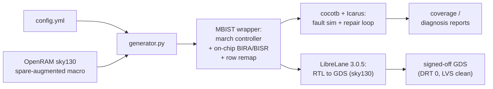

# autoMBIST

[](https://github.com/ranaumarnadeem/autoMBIST/actions/workflows/test.yml)
[](https://ranaumarnadeem.github.io/autoMBIST/)
[](LICENSE)

**[📖 Full documentation](https://ranaumarnadeem.github.io/autoMBIST/)** — quickstart,
installation, a worked example, the flow architecture, configuration
reference, the LibreLane hardening recipe, challenges, and the roadmap.

**An open-source, OpenRAM-integrated MBIST + BIRA + BISR generator and
march-algorithm research platform — proven through open RTL-to-GDS closure on
sky130.**

autoMBIST is a CLI for testing memory macros for manufacturing defects,
repairing them with built-in row and column redundancy, and researching the
march algorithms used to do it. It is two independent subsystems bundled behind
one command:

1. **MBIST wrapper generation + array fault simulation** (`generate`, `simulate`,
   `run`, `grade-controller`) — takes an OpenRAM-style SRAM macro and a config
   file describing its pins, and emits a production-style, synthesizable MBIST
   wrapper plus march-algorithm controller RTL around it. It can also inject
   stuck-at, transition, or (for multi-port memories) inter-port coupling
   faults into a saboteur copy of the memory and run the generated controller
   against it through cocotb + Icarus Verilog to measure fault coverage.
2. **Functional fault-primitive research platform** (`test`, `algo`) — an
   independent, Verilator-driven toolchain built around a 19-primitive
   functional fault-model DSL and a programmable march-algorithm engine. It
   lets you grade a march algorithm (or an actual controller FSM) against a
   fault list, and ships an interactive shell (`autombist algo`) for
   registering custom algorithms/faults, running campaigns, and exporting
   reports or standalone testbenches.

These two subsystems don't share RTL, a simulator, or a fault format — see
["Which subsystem do I want?"](#which-subsystem-do-i-want) before you start.
`generate`/`simulate` is Icarus + cocotb and speaks array-level fault masks;
`test`/`algo` is Verilator-only and speaks the 19-primitive functional DSL.

## Table of Contents

- [Which subsystem do I want?](#which-subsystem-do-i-want)
- [Redundancy repair (BIRA/BISR) and physical closure](#redundancy-repair-birabisr-and-physical-closure)
- [Prerequisites](#prerequisites)
- [Installation](#installation)
- [Quick Start](#quick-start)
- [What It Generates](#what-it-generates)
- [Fault Simulation Flow](#fault-simulation-flow)
- [Multi-Port Memories (march-1r1w)](#multi-port-memories-march-1r1w)
- [Multi-Port Memories (march-2rw)](#multi-port-memories-march-2rw)
- [Functional Fault-Primitive Grading (test / algo)](#functional-fault-primitive-grading-test--algo)
- [Fault coverage](#fault-coverage)
- [Controller Structural Grading (grade-controller)](#controller-structural-grading-grade-controller)
- [OpenRAM Synthesis + Starter Scaffolding](#openram-synthesis--starter-scaffolding)
- [Interactive Tcl Shell (autombist shell)](#interactive-tcl-shell-autombist-shell)
- [CLI Help](#cli-help)
- [Further Documentation](#further-documentation)

## Which subsystem do I want?

**I have a real memory macro and want to MBIST-test it (or grade the
controller against manufacturing faults):**
use the classic path — `autombist generate` → `autombist simulate` (or
`autombist run` to do both), and optionally `autombist grade-controller` for
the controller's own scan-ATPG structural coverage. Start at
[Quick Start](#quick-start).

**I want to design or validate a march algorithm, measure its functional fault
coverage, or check a controller FSM's behavior against a fault library — with
no real memory macro required:** use the research path — `autombist test` for
one-shot grading, or `autombist algo` for the interactive shell. Start at
[Functional Fault-Primitive Grading](#functional-fault-primitive-grading-test--algo).

Both paths are documented in full below; the config format, simulators, and
fault vocabulary are not interchangeable between them.

## Redundancy repair (BIRA/BISR) and physical closure

Beyond generating a test wrapper, autoMBIST closes the loop: it wraps a
spare-augmented OpenRAM macro with **redundancy analysis (BIRA)** and
**self-repair (BISR)**, and hardens the result to GDS through the open
[LibreLane](https://github.com/librelane/librelane) flow.

- **External row- and column-repair remaps** around a *stock* spare-augmented
  OpenRAM macro — the repair steering lives in standard-cell logic in the
  wrapper ([`rtl/repair_remap_row.sv`](rtl/repair_remap_row.sv) steers addresses
  to spare rows, [`rtl/repair_remap_col.sv`](rtl/repair_remap_col.sv) steers bit
  lanes onto spare columns), so it simulates *and* hardens with no special macro
  views. Column repair is tester-driven; the autonomous on-chip analyzer is
  row-only for now.
- **2D BIRA solver**
  ([`src/autombist/repair/bira.py`](src/autombist/repair/bira.py)) — must-repair
  fixed point + backtracking, cross-checked against a brute-force oracle.
- **Autonomous on-chip self-repair FSM**
  ([`rtl/onchip_selfrepair_ctrl.sv`](rtl/onchip_selfrepair_ctrl.sv) +
  [`rtl/onchip_row_repair_analyzer.sv`](rtl/onchip_row_repair_analyzer.sv)) — runs
  analyze → decide → verify with no tester, from a single `self_repair_start`.
  Covers march-c, march-raw, march-x, mats-plus, and march-1r1w (the first
  multi-port self-repair — one `repair_remap_row` steers both ports off the
  FSM's shared address register); march-2rw is deliberately out of scope,
  since its concurrent same-cycle dual compare breaks the analyzer's
  single-fail-per-cycle assumption.
- **Proven RTL-to-GDS closure** of a realistic 3-memory sky130 subsystem with
  self-repair wrapped around every memory
  ([`flow/multimem/mbist/`](flow/multimem/mbist/)) in LibreLane 3.0.5: **0.91
  mm² die, 7,189 std cells, 0 detailed-routing violations, LVS-clean including
  power** (macro-internal Magic/KLayout DRC — 589/3194 — explicitly non-fatal
  by config; see [the CLI reference](https://ranaumarnadeem.github.io/autoMBIST/cli-reference.html#harden) for
  why). The same three macros without the MBIST wrap
  ([`flow/multimem/`](flow/multimem/)) harden the same way at 0.78 mm² die,
  ~51% memory area, 4,158 std cells. The same self-repair-through-hardening
  result also holds for march-X and MATS+ wrapping real OpenRAM macros
  ([`flow/newalgo/`](flow/newalgo/)), and for a real RV32I core (PicoRV32)
  booting and running firmware through self-repaired memory
  ([`flow/soc/`](flow/soc/)).



See [`flow/multimem/`](flow/multimem/) + [the demo walkthrough](https://ranaumarnadeem.github.io/autoMBIST/demo.html)
for the reproducible hardening flow. This subsystem currently ships as the
[`repair/`](src/autombist/repair/) Python library plus the RTL and flow configs;
a dedicated top-level CLI surface is in progress.

## Prerequisites

> **Platform.** `autombist generate` (wrapper/RTL emission) and config/algorithm-spec
> tooling run anywhere Python 3.10+ runs. Everything that invokes a simulator or
> synthesis tool — `simulate`, `run`, `test`, `algo`'s `run`/`compare_algo` commands, and
> `grade-controller --run` — needs the Unix EDA toolchain (Icarus Verilog, Verilator,
> Yosys, OpenRAM, and the optional FaultFlow flow) and only works on Linux or WSL. Use a
> venv created inside WSL/Linux for any of those — a Windows-side Python/venv cannot see
> the WSL-installed toolchain.

1. Python 3.10+
2. OpenRAM-generated memory and matching config file (classic path only)
3. For fault simulation:
	- Icarus Verilog (`iverilog`) installed system-wide (array-fault `simulate`/`run`)
	- Verilator installed system-wide (functional fault-primitive `test`/`algo` commands)
	- Cocotb installed in your Python environment
4. For controller structural grading (`grade-controller`): Yosys and a built
   [FaultFlow](https://github.com/ranaumarnadeem/faultflow) repo

## Installation

**All of the following must be run from inside WSL or a native Linux shell** —
a Windows-native Python install will not see `iverilog`/`verilator`/`yosys`
even if they're on the WSL side.

Recommended — [Nix](https://github.com/ranaumarnadeem/autoMBIST/blob/main/flake.nix)
pins the exact toolchain CI uses (Icarus 13.0, Verilator 5.048, Yosys 0.62,
Python 3.11, cocotb 2.x) and puts the `autombist` CLI on `PATH` immediately,
no separate `pip install` step:

```bash
nix develop
```

Without Nix, from the repository root:

```bash
sudo apt-get install iverilog verilator yosys
python -m pip install -e .
```

Full details, including the physical/signoff toolchain: see
[Installation](https://ranaumarnadeem.github.io/autoMBIST/installation.html)
in the docs.

## Quick Start

This gets you from a fresh checkout to a first generate + simulate run.

```bash
# 1. Inside WSL/Linux, from the repo root:
nix develop

# 2. Scaffold a starter config in the current directory
autombist init --out .

# 3. Generate the MBIST wrapper + RTL for the memory described in config.yml
autombist generate --config config.yml --out out

# 4. Simulate the generated design with cocotb + Icarus
autombist simulate --out out/<memory_name>

# ...or do steps 3+4 in one shot:
autombist run --config config.yml --out out
```

`<memory_name>` is the `memory_name` field from your config file — each memory
gets its own subdirectory under `out/`.

Sanity-check your whole install (generation + OpenRAM config parse + optional
small fault simulations) with:

```bash
autombist smoke
```

Check which optional EDA tools (Icarus, Verilator, Yosys, Nix, bash, Magic,
netgen, cocotb, FaultFlow) autombist can actually find on this system:

```bash
autombist doctor
```

`simulate`, `run`, and `test` also accept `--json` to print the full
structured report to stdout instead of the human summary — handy for piping
into `jq` or other tooling.

## What It Generates

For each memory in your config, `autombist generate` produces a module
directory under `out/<memory_name>/` with:

- MBIST wrapper Verilog
- Required MBIST RTL support files
- Optional saboteur wrapper for fault injection (`--test` mode)
- Optional fault masks and a local simulation Makefile (`--test` mode)
- Algorithm-specific RTL for the selected `--algo` family

The generated artifacts are plain synthesizable Verilog and can be fed into
Yosys or any other synthesis tool.

## Fault Simulation Flow

The example below selects `march-c` (the default); single-port memories can
equally pass `march-raw`, `march-x`, or `mats-plus` to `--algo` (multi-port
memories use `march-1r1w` or `march-2rw` — see their dedicated sections
below). Note that this `mats-plus` is the classic-path RTL wrapper
(`rtl/mats_plus/`) — a separate implementation from the research engine's
`mats_plus` algorithm spec used by `test`/`algo` in the
[fault-coverage table](#fault-coverage) further down.

Generate fault-enabled artifacts (saboteur + fault masks + module Makefile):

```bash
autombist generate --config config.yml --out out --test --faults 50 --seed 1234 --algo march-c --fault-type stuck-at
```

This command injects random `SA0`/`SA1` faults into the memory model and writes fault files to:

```text
out/<memory_name>/faults/
```

Then run simulation:

```bash
autombist simulate --out out/<memory_name>
```

For transition fault simulation, set `--fault-type transition-up` or `--fault-type transition-down`, then run `autombist simulate --out out/<memory_name>`.

## Multi-Port Memories (`march-1r1w`)

Beyond single-port memories, autombist supports a 1-read-port + 1-write-port (1R1W)
memory shape with a genuinely concurrent MBIST algorithm: the read port and write port
issue to the same address on the same clock edge, which is what lets it catch inter-port
bridging defects a "test each port separately" approach structurally cannot.

Describe a multi-port memory with a named `ports:` map instead of the flat single-port
form (`type: r` for the read-only port, `type: w` for the write-only port):

```yaml
memory_name: "sram_1r1w_64x32"
wrapper_module_name: "sram_1r1w_64x32_mbist"
addr_width: 6
data_width: 32
we_active_low: true
ports:
  rport:
    type: r
    clk: clkA
    addr: addrA
    dout: doutA
    csb: csbA
  wport:
    type: w
    clk: clkB
    addr: addrB
    din: dinB
    csb: csbB
    we: webB
```

Generate and simulate it like any other memory, selecting `--algo march-1r1w`:

```bash
autombist generate --config config.yml --out out --algo march-1r1w
autombist simulate --out out/sram_1r1w_64x32
```

In addition to `stuck-at`/`transition-up`/`transition-down`, march-1r1w configs support a
`port-coupling` fault type — an aggressor write on the write port disturbing a victim
read on the read port, sensitized only by a genuine same-cycle, same-address concurrent
access:

```bash
autombist generate --config config.yml --out out --test --faults 20 --algo march-1r1w --fault-type port-coupling
autombist simulate --out out/sram_1r1w_64x32
```

The legacy flat single-port `ports:` form (`{clk, addr, din, dout, we, csb}`) still works
unchanged and renders byte-identical output — no existing config needs to change.

march-1r1w is also the first multi-port algorithm to support on-chip
self-repair (`redundancy.onchip_selfrepair: true` — see
["Redundancy repair"](#redundancy-repair-birabisr-and-physical-closure)
above): a single `repair_remap_row` steers both ports off the FSM's shared
address register. march-2rw does not support this — see below.

## Multi-Port Memories (`march-2rw`)

`march-2rw` generalizes further: two *fully symmetric* read/write ports (both ports can
independently read or write on any cycle), rather than march-1r1w's one-read-only +
one-write-only split. This lets the march-2rw algorithm exercise access patterns
march-1r1w structurally cannot express — concurrent write/write to two *different*
addresses, and concurrent read/read to the *same* address — on top of the same
read(one port)/write(other port) same-address forwarding case march-1r1w already covers.

Describe it with a named `ports:` map where **both** entries use `type: rw`:

```yaml
memory_name: "sram_2rw_64x32"
wrapper_module_name: "sram_2rw_64x32_mbist"
addr_width: 6
data_width: 32
we_active_low: true
ports:
  porta:
    type: rw
    clk: clkA
    addr: addrA
    din: dinA
    dout: doutA
    csb: csbA
    we: webA
  portb:
    type: rw
    clk: clkB
    addr: addrB
    din: dinB
    dout: doutB
    csb: csbB
    we: webB
```

Generate and simulate it like any other memory, selecting `--algo march-2rw`:

```bash
autombist generate --config config.yml --out out --algo march-2rw
autombist simulate --out out/sram_2rw_64x32
```

**Port-ordering rule (important, and different from march-1r1w):** since both march-2rw
ports share the same `type: rw`, there is no type-based way to tell them apart, unlike
march-1r1w where the "r" port always maps to `sram_*0` and the "w" port always maps to
`sram_*1` regardless of YAML key order. For march-2rw, the **first entry** in the `ports:`
map (YAML/dict insertion order) is always wired to the algorithm's `sram_*0` pins, and the
**second entry** to `sram_*1`. Swapping the two entries' order in the YAML swaps which
named port is "port 0" vs "port 1" — the config above wires `porta` to `sram_*0` and
`portb` to `sram_*1`; reversing their order in the file would reverse that mapping.

march-2rw supports `stuck-at`, `transition-up`, and `transition-down` fault types (not
`port-coupling`, which is specific to march-1r1w's asymmetric read/write-port split):

```bash
autombist generate --config config.yml --out out --test --faults 20 --algo march-2rw --fault-type stuck-at
autombist simulate --out out/sram_2rw_64x32
```

march-2rw's functional (`test_mode=0`) boundary is inherently single-port: only the port
wired to `sram_*0` drives `func_dout` in functional mode. The second port exists for the
MBIST algorithm's internal concurrency, not for external dual-port functional access.

march-2rw does not support on-chip self-repair (`redundancy.onchip_selfrepair`) — its
concurrent same-cycle dual compare breaks the analyzer's single-fail-per-cycle assumption.
This is a deliberate scope boundary, not a gap slated to be filled by more config; see
march-1r1w above for the multi-port algorithm that does support self-repair.

## Functional Fault-Primitive Grading (`test` / `algo`)

This is the research platform — it does not require an OpenRAM memory or a
`config.yml`. Beyond the array-level stuck-at/transition masks above, autombist
ships a richer functional fault library (19 primitives: stuck-at, transition,
write/read disturb, address-decoder, and all four coupling classes) and a
programmable march-algorithm engine, driven through Verilator instead of Icarus.

Grade a memory + march algorithm against a fault list in one shot:

```bash
autombist test --addr-width 8 --data-width 8 --algo march_c --faults faults.txt
autombist test -aw 10 -dw 32 --algo march_ss --faults faults.txt --report cov.md
```

Custom fault primitives, beyond the built-in 19, can be added from a JSON spec file with
`--fault-types` (validated and appended to the built-in registry):

```bash
autombist test -aw 8 -dw 8 --algo march_ss --faults faults.txt --fault-types mytypes.json
```

Or validate an actual controller FSM (rather than an algorithm spec) against the same
fault library:

```bash
autombist test -aw 10 -dw 32 --fsm rtl/march_c/march_c_top.sv --faults faults.txt
```

For interactive exploration — registering custom algorithms/fault instances, running
campaigns, comparing against the built-in marches, and exporting reports or standalone
testbenches — launch the research shell:

```bash
autombist algo
autombist algo --script session.algo   # or '-' for stdin
```

Run `help` inside the shell for the full command list.

Multi-port campaigns (genuine cross-port coupling faults, not just single-port) are also
supported: `set_memory --ports 2` in the shell (or `MemoryParams(num_ports=2)` via the
Python API) switches to the `march_engine_mp.sv` engine, and `add_fault`'s optional
trailing `VPORT APORT` arguments define which physical port the victim/aggressor side of
a fault uses. See [the Multi-Port Memory Guide](https://ranaumarnadeem.github.io/autoMBIST/multi-port-guide.html) and
`src/autombist/engine/README.md`'s "Multi-port" section for the full `.alg`/fault-list
syntax and same-port-vs-cross-port semantics.

## Fault coverage

The research path grades a march algorithm against the 19-primitive functional
fault model. Measured detection (**D**) vs escape (**E**) against
`src/autombist/engine/faults.example.txt` (regenerable via
`algo_reporting.write_matrix_report`; full per-primitive semantics and
escape rationale in
[`src/autombist/engine/README.md`](src/autombist/engine/README.md)):

| Fault | MATS+ (5n) | March C- (10n) | March SS (22n) |
|---|---|---|---|
| SA0, SA1 | D | D | D |
| TF0, TF1 | D | D | D |
| WDF0, WDF1 | E | E | D |
| RDF0, RDF1 | D | D | D |
| DRDF0, DRDF1 | E | E | D |
| IRF0, IRF1 | D | D | D |
| SOF | E | E | E |
| AF_NOACC, AF_ALIAS | D | D | D |
| CFIN | D | D | D |
| CFID | E | D | D |
| CFST | D | D | D |
| CFDS (any-read) | E | D | D |
| **total** | **12/19** | **14/19** | **18/19** |

These match the published coverage claims — March C- misses WDF (no
non-transition write) and DRDF (no read-after-read); March SS adds both. The SOF
escape under a solid-background march is correct behavior (its detection needs
consecutive opposite-data reads), not a model bug — see the engine README.

## Controller Structural Grading (`grade-controller`)

Grade the MBIST controller logic itself (not the memory array) with FaultFlow's scan
stuck-at ATPG, with the memory macro blackboxed:

```bash
autombist grade-controller --out out --faultflow-repo ~/faultflow
autombist grade-controller --out out --no-run     # just emit the re-runnable bundle
```

Requires Yosys and a built FaultFlow repo (path via `--faultflow-repo` or `$FAULTFLOW_HOME`),
Linux/WSL only.

`autombist run --faultflow` does `generate` + `simulate` + `grade-controller` in one
command:

```bash
autombist run --config config.yml --faultflow --faultflow-repo ~/faultflow
```

## OpenRAM Synthesis + Starter Scaffolding

Generate starter files (`config.yml`, `openram.yml`, and `Makefile`) for a new project:

```bash
autombist init --out .
```

Synthesize SRAM through OpenRAM from config:

```bash
autombist ram-synth --config openram.yml
```

Show the exact OpenRAM command before execution:

```bash
autombist ram-synth --config openram.yml --show-command
```

Run installation smoke checks (generation + OpenRAM config parse + optional small fault simulations for coverage):

```bash
autombist smoke
autombist smoke --no-sim
```

## Interactive Tcl Shell (`autombist shell`)

For users who live in OpenROAD/OpenSTA/magic-style Tcl consoles, autombist also
ships an EDA-native alternative to the Typer CLI: a Tcl shell built on
`tkinter.Tcl()` (the stdlib's only Tcl binding), with 10 commands mirroring the
CLI 1:1 as thin adapters over the same core library calls — `generate`,
`simulate`, `run`, `test`, `harden`, `fix_lef_units`, `macro_signoff`,
`grade_controller`, `ram_synth`, `doctor`:

```bash
autombist shell                    # interactive REPL
autombist shell --file session.tcl # batch mode
```

Commands use EDA-style `-flag value` syntax and return Tcl-usable values, so
sessions script naturally:

```tcl
set cov [simulate -out out]
if {$cov < 90} { error "coverage too low" }
```

Failures raise real, catchable Tcl errors (`catch {...} err`). One gotcha worth
knowing: Tcl's `"..."` double-quotes apply backslash substitution, so a Windows
path typed as `"C:\Users\me\config.yml"` silently loses its backslashes — use
`{...}` brace-quoting instead, which is fully literal:
`generate -config {C:\Users\me\config.yml}`.

Requires `tkinter` (already in this repo's Nix flake; `apt install python3-tk`
on Debian/Ubuntu for non-Nix setups) — if it's missing, every other `autombist`
command still works fine; only `shell` reports an actionable error and exits 1.

## CLI Help

```bash
autombist --help
autombist --version
```

Every command also accepts global `-v/--verbose` and `-q/--quiet` on `autombist`
itself, before the subcommand (mutually exclusive; `-v` is ORed with any
command-specific `--verbose`):

```bash
autombist -v run --config config.yml
```

## Further Documentation

This README covers install and the common day-to-day commands. For deeper
detail, see the published docs site:

- [Architecture](https://ranaumarnadeem.github.io/autoMBIST/architecture.html) — how the two subsystems
  (wrapper/generator + fault-primitive engine) are structured internally, and
  how the pieces (generator, saboteur, march engines, shell) fit together.
- [CLI Reference](https://ranaumarnadeem.github.io/autoMBIST/cli-reference.html) — flag-by-flag reference for
  the classic-path and hardening commands (`generate`, `simulate`, `run`,
  `grade-controller`, `ram-synth`, `harden`, `fix-lef-units`, `macro-signoff`,
  `init`, `smoke`).
- [Algo-Shell Guide](https://ranaumarnadeem.github.io/autoMBIST/algo-shell-guide.html) (experimental) — the `autombist test`
  and `autombist algo` research subsystem: registering algorithms and fault
  instances, running campaigns, comparing marches, exporting reports/testbenches.
- [Multi-Port Memory Guide](https://ranaumarnadeem.github.io/autoMBIST/multi-port-guide.html) — full reference for
  `march-1r1w` and `march-2rw` config shapes, port-coupling faults, and
  multi-port fault-campaign syntax in both the classic and algo-shell paths.
- [Diagnosis / Fail-Bitmap Reports](https://ranaumarnadeem.github.io/autoMBIST/diagnosis-reports.html) — how to read
  generated coverage/diagnosis reports (fail-bitmap, fault_details, JSON/CSV/MD
  formats) from both subsystems.
- [OpenROAD / LibreLane Macro Integration](https://ranaumarnadeem.github.io/autoMBIST/openroad-macro-integration.html) —
  how an SRAM plugs into the LibreLane / OpenROAD / OpenRAM hard-macro flow.
- [Demo](https://ranaumarnadeem.github.io/autoMBIST/demo.html) — a one-command, zero-to-result walkthrough
  covering both subsystems and the hardening flow.
- [`CONTRIBUTING.md`](CONTRIBUTING.md) — development setup, test markers, and
  how to submit changes.
